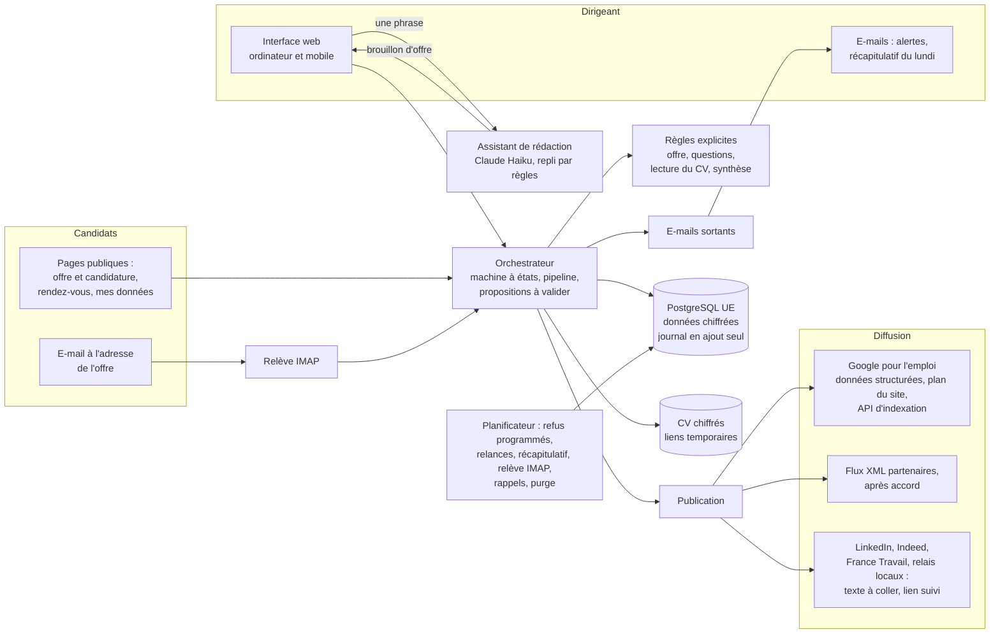
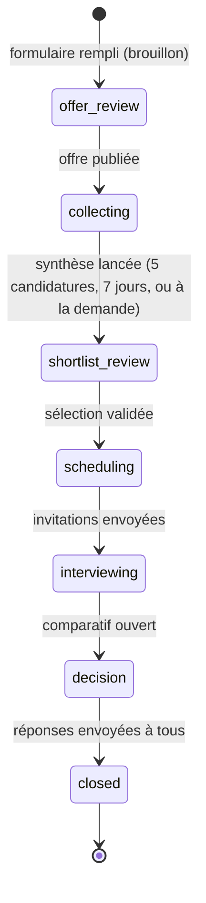

# Architecture

## Vue d'ensemble

Un processus web (FastAPI) sert l'API, l'interface React compilée et les pages de diffusion :
`/offres/<jeton>` (avec ses données structurées), `/sitemap.xml`, `/robots.txt`,
`/feeds/<id>.xml`.

Les tâches différées et périodiques passent par la table `jobs` et `worker.tick()` :

- `JOBS_MODE=inline` (hébergement à un seul processus, comme Render) : les tâches immédiates
  tournent dans la requête, et un **planificateur intégré** (`scheduler.py`, un fil d'exécution
  démarré avec l'application) appelle `worker.tick()` toutes les `SCHEDULER_INTERVAL_SECONDS` ;
- `JOBS_MODE=worker` (Docker Compose) : le conteneur `worker` s'en charge et le planificateur
  intégré reste éteint.

Le seul appel à un modèle de langage est la rédaction d'un brouillon d'offre
(`modules/assistant.py`) ; il ne reçoit jamais de donnée de candidat.

## Cinq pages par recrutement

| Page | Adresse | Ce que le dirigeant y fait |
|---|---|---|
| Offre | `/recrutements/<id>/offre` | Relire, publier, cocher les sites où il a posté l'offre, copier le texte adapté à chacun |
| Candidatures | `…/candidatures` | Pipeline (glisser-déposer ou menu « Déplacer ») ou liste ; ajouter un candidat reçu ailleurs ; valider la sélection |
| Entretiens | `…/entretiens` | Inviter, fixer les dates (ou ouvrir des créneaux en ligne, Pro), grille d'entretien |
| Débrief | `…/debrief` | Noter chaque entretien sur la grille |
| Décision | `…/decision` | Comparer, choisir, répondre à tous ; suivi à 3 et 6 mois |

La fiche d'un candidat (tiroir latéral) réunit le CV, les réponses aux questions, la synthèse
critère par critère, les notes de l'équipe et l'historique complet (candidature, e-mails envoyés,
déplacements, notes, refus programmé ou annulé), assemblé par `views.timeline_view`.

## Machine à états d'un recrutement

Chaque étape avance par la validation d'une **proposition** (`Proposal`) : offre, lancement de la
synthèse, sélection, invitations, décision, réponses à tous, suivi. Une proposition se valide
telle quelle, après modification, ou se refuse ; les trois issues sont journalisées.

## Pipeline

Les six colonnes sont calculées à partir du statut de chaque candidature
(`orchestrator.stage_of`) ; le pipeline n'ajoute pas d'état parallèle à la machine du
recrutement :

| Colonne | Statuts | Arrivée |
|---|---|---|
| Reçu | `received`, jamais ouverte (`seen_at` vide) | candidature reçue ; s'ouvrir sur la fiche la fait passer à « À évaluer » |
| À évaluer | `received` ou `screened`, ouverte | ouverture, ou retour depuis « Présélectionné » |
| Présélectionné | `shortlisted`, `invited`, ou proposée dans la sélection en attente | glisser la carte (ajoute à la sélection proposée) ou valider la sélection |
| Entretien | `booked`, `interviewed` | date fixée (fenêtre de date à l'arrivée dans la colonne) |
| Refusé | `rejected`, `not_shortlisted` | décision du dirigeant ; remerciement programmé si l'automatisation est active |
| Embauché | `hired` | décision (confirmation, puis page Décision) |

`pipeline_move` applique les mêmes règles que l'interface (`targetsFor`) et refuse les
déplacements impossibles (par exemple vers « Embauché » avant les entretiens).

## Assistant de rédaction (`modules/assistant.py`)

1. `parse_brief` lit la phrase par règles : famille de métier (une vingtaine), années, salaire
   (brut ou net, signalé), ville, contrat, télétravail, logiciels, langues, permis, diplômes,
   habilitations.
2. Si `ANTHROPIC_API_KEY` est renseignée, l'API Messages est appelée avec une consigne versionnée
   (`PROMPT_VERSION`) et un appel d'outil imposé (`remplir_fiche_de_poste`) : la réponse est une
   fiche structurée, pas du texte libre.
3. `_merge` fusionne les deux : ce que la phrase dit explicitement l'emporte ; salaire, lieu et
   contrat ne viennent **que** de la phrase (jamais inventés) ; les questions passent par les
   garde-fous du formulaire.
4. En cas d'absence de clé, d'erreur ou de délai dépassé (`AI_TIMEOUT_SECONDS`), le résultat des
   règles est renvoyé, avec la mention « préparé à partir de votre phrase ».

Limite : `AI_DAILY_LIMIT` brouillons par entreprise et par jour. Chaque appel crée un
`usage_records` (`ai:draft`, jetons, coût) et un événement d'audit `offer.drafted` (modèle,
version de la consigne). La provenance est gardée dans la fiche du poste (`profile.assisted`).

## Candidatures centralisées

| Canal | Entrée | Provenance |
|---|---|---|
| Formulaire public | `/offres/<jeton>?src=<site>` | le site d'où vient le lien (`linkedin`, `indeed`, `france_travail`, `local`, `google`…) |
| E-mail | `offres+<jeton>@domaine` relevé par IMAP (`services/inbound.py`) ; message transféré par le dirigeant rattaché à l'expéditeur d'origine | `email` |
| Ajout manuel | fenêtre « Ajouter un candidat » (`orchestrator.add_candidate`) | choisie par le dirigeant : message LinkedIn, e-mail, téléphone, Indeed, France Travail, candidature spontanée, recommandation, salon, relais locaux, autre |

Une candidature par e-mail ou ajoutée à la main reçoit l'accusé de réception RGPD et, si l'offre a
des questions, le lien pour y répondre (`awaiting_completion` / `complete_application`) ; une
relance unique part ensuite si l'automatisation est active.

## Automatisations (`services/automations.py`)

| Automatisation | Déclencheur | Offre |
|---|---|---|
| Remerciement des refusés | Classement « Refusé » → tâche `send_rejection` après `AUTO_REJECT_DELAY_MINUTES` ; « Annuler » rétablit le statut précédent sans rien envoyer | Pro, Agence |
| Relance des non-répondants | Candidatures sans réponses aux questions, invitations sans date, après N jours (réglable) ; une seule fois | Pro, Agence |
| Récapitulatif du lundi | `WEEKLY_RECAP_WEEKDAY`, `WEEKLY_RECAP_HOUR` (heure de Paris) ; candidatures par provenance, présélections, entretiens, ce qui attend | Pro, Agence |
| Alerte de candidature | Chaque nouvelle candidature, avec le lien vers le pipeline | Toutes |

Réglages par entreprise dans `companies.automations` (JSON) ; activer une automatisation payante
demande l'offre correspondante (`plans.require`).

## Offres (`services/plans.py`)

`FEATURES` et `PLANS` décrivent Gratuit (`free`), Pro (`premium`) et Agence (`agency`). Chaque route
concernée appelle `plans.require(...)`, qui lève une erreur transformée en HTTP 402 avec
`upgrade: true` (l'interface ouvre la fenêtre des offres). L'historique est filtré à 30 jours en
Gratuit (`history_since`), sans effet sur la conservation des données.

## Publication (`services/publication.py`)

- **Google pour l'emploi** : la page `/offres/<jeton>` est servie avec ses balises et le bloc
  JSON-LD `JobPosting` (`page_head`, `job_posting`) ; `/sitemap.xml` liste les offres ouvertes ;
  si `GOOGLE_INDEXING_CREDENTIALS` est renseigné, publication, modification et clôture sont
  signalées à Google.
- **Flux partenaires** : `/feeds/<id>.xml`, servis seulement pour les plateformes listées dans
  `PUBLICATION_FEEDS` (après accord) ; elles comptent alors comme canaux automatiques.
- **Sites manuels** (`MANUAL`) : LinkedIn, Indeed, France Travail, relais locaux. `platform_text`
  produit un texte adapté à chacun (sans émoticônes, mot-dièse pour LinkedIn) avec le lien
  `?src=<site>` ; le dirigeant coche « Publiée » (`mark_posted`). Si l'offre change après coup, la
  ligne passe « À mettre à jour ». À la clôture, les sites cochés passent « À retirer » et un
  rappel est envoyé : WayLoop ne peut pas les retirer à sa place.
- La diffusion ne contient que l'offre, jamais de donnée de candidat.

## Données

| Table | Contenu | Chiffré |
|---|---|---|
| companies, users | Entreprise, offre souscrite, réglages des automatisations, date du dernier récapitulatif ; utilisateurs (propriétaire, membres) | — |
| login_tokens | Liens de connexion et liens d'action, sous forme d'empreinte | — |
| recruitments | Fiche du poste (dont questions libres et provenance du brouillon), état, jalons, issue | — |
| offers | Texte versionné, mentions à retirer, diffusion (statut par site, automatique ou manuel) | — |
| candidates | Identité, contact, dernier contact | oui |
| applications | CV, texte, réponses, message, provenance, ajoutée par, vue le, relance, refus programmé / envoyé, statut avant refus | oui |
| candidate_notes | Notes de l'équipe sur une candidature | oui |
| inbound_emails | Empreinte du Message-ID, recrutement, candidature créée, issue du traitement | — |
| screening_evaluations | Critère par critère : réponse, statut, règle, extraits, version des règles | oui |
| slots, interviews, interview_grids, debriefs | Créneaux, entretiens, grilles, notes d'entretien | oui (notes) |
| decisions, proposals | Décisions et propositions | — |
| audit_events | Journal chaîné, sans donnée personnelle en clair | — |
| purge_schedule | Date de suppression calculée par donnée | — |
| outbound_messages | E-mails envoyés, purgés avec le candidat | oui |
| jobs, usage_records, stripe_events | File de tâches ; e-mails envoyés et brouillons IA (jetons, coût) ; événements de paiement traités | — |

Migration `0004` : tables `candidate_notes` et `inbound_emails`, colonnes du pipeline et des
automatisations ; les candidatures déjà traitées sont marquées « vues » pour ne pas revenir dans
« Reçu ».

## Sécurité

- Connexion par lien magique (usage unique, 30 min) ; session par cookie signé `HttpOnly`,
  `SameSite=Lax`, `Secure` en HTTPS. Les liens d'action des e-mails ouvrent une page : aucune
  action n'est exécutée par un simple chargement de lien.
- Jetons stockés sous forme d'empreinte HMAC ; données candidats et notes chiffrées (Fernet) ; CV
  servis uniquement par liens signés de 5 minutes.
- Équipe (Agence) : un membre retiré perd l'accès immédiatement ; son adresse est remplacée par une
  valeur neutre et ses recrutements sont réattribués au propriétaire.
- Pages publiques : champ piège anti-robots, limitation de débit par IP, en-têtes de sécurité.
- Webhook entrant : Stripe seulement, signature vérifiée, événements déjà traités ignorés. Les
  e-mails entrants sont relevés par IMAP (aucun point d'entrée public) ; les réponses
  automatiques et les rejets de messagerie sont ignorés.
- Clé d'API du fournisseur d'IA : variable d'environnement côté serveur, jamais exposée à
  l'interface.
