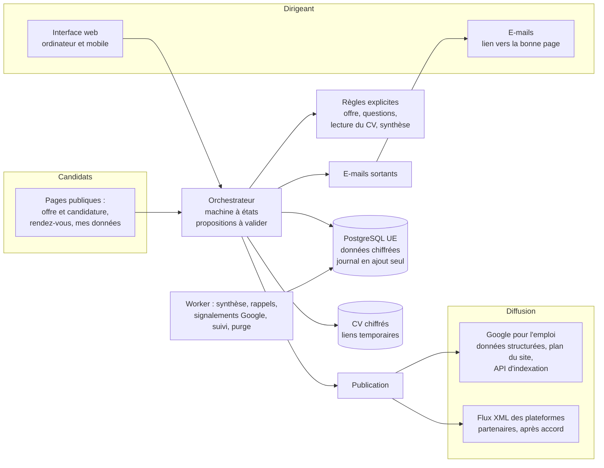
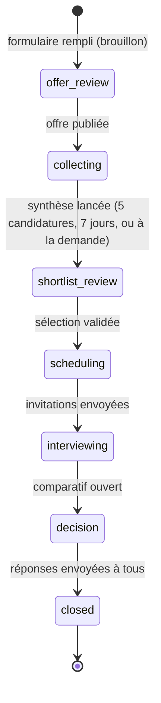

# Architecture

## Vue d'ensemble

Un seul processus web (FastAPI) sert l'API, l'interface React compilée et les pages de diffusion :
`/offres/<jeton>` (avec ses données structurées), `/sitemap.xml`, `/robots.txt`,
`/feeds/<id>.xml`. Un second processus, le *worker*, exécute les tâches longues et périodiques. En
mode `JOBS_MODE=inline` (dev, tests), les tâches immédiates tournent dans la requête.

Aucun modèle d'IA, aucun service de messagerie instantanée : tout repose sur des règles écrites
dans le code et sur l'e-mail.

## Cinq pages par recrutement

| Page | Adresse | Ce que le dirigeant y fait |
|---|---|---|
| Offre | `/recrutements/<id>/offre` | Relire, publier, suivre la diffusion, retoucher le texte |
| Candidatures | `…/candidatures` | Consulter, préparer et valider la sélection, écrire ou répondre en masse |
| Entretiens | `…/entretiens` | Inviter, fixer les dates (ou ouvrir des créneaux en ligne, Premium), grille d'entretien |
| Débrief | `…/debrief` | Noter chaque entretien sur la grille |
| Décision | `…/decision` | Comparer, choisir, répondre à tous ; suivi à 3 et 6 mois |

S'y ajoutent « Historique » (journal lisible, dans le menu ⋯) et, hors recrutement, l'agenda de
tous les entretiens (`/entretiens`). La page à ouvrir est calculée par `orchestrator.step_of` :
pendant les entretiens, l'étape passe à Débrief dès qu'un entretien a eu lieu sans être noté, puis
à Décision quand tous les entretiens sont notés. Chaque proposition est rattachée à sa page
(`KIND_PAGE`) ; le lien de l'e-mail de notification ouvre directement cette page. Les onglets
portent des compteurs (`views._counts`) : candidatures, entretiens à fixer, entretiens à noter.

## Machine à états d'un recrutement

L'assistant de création publie en un geste (`create_recruitment(publish=True)` : brouillon puis
publication dans la même requête) ; « Enregistrer en brouillon » s'arrête à `offer_review`. Un
recrutement peut être abandonné à tout moment (`abandoned`) ; un candidat peut être ajouté aux
entretiens après coup, sans changer d'état.

Chaque étape avance par la validation d'une **proposition** (`Proposal`) : offre, lancement de la
synthèse, sélection, invitations, décision, réponses à tous, suivi à 3 et 6 mois. Une proposition
se valide telle quelle (« accepted »), après modification (« modified ») ou se refuse ; les trois
issues sont journalisées. Toutes les propositions se valident par la même route
(`accept_by_kind`) ; le lien d'un e-mail n'exécute rien, il ouvre la page où se trouve le bouton.

## Moteur de règles (identique en Gratuit et en Premium)

| Étape | Fonctionnement | Code |
|---|---|---|
| Besoin | Formulaire typé : intitulé choisi dans le ROME, missions, critères à seuil (expérience, compétence, diplôme, permis, langue, habilitation, autre), rémunération obligatoire | `modules/form.py`, `services/referentiels.py` |
| Offre | Modèle de texte rempli avec les champs du formulaire ; mise en conformité silencieuse (`sanitize`) : « (H/F) » ajouté, reformulations sûres ; seule une mention impossible à corriger est signalée sous son champ | `modules/templates.py`, `modules/compliance.py` |
| Questions aux candidats | Une question par critère, générée par règle (`questions_for`) | `modules/form.py` |
| Synthèse | Réponse déclarée comparée au seuil (`evaluate_declared`), croisée avec la lecture du CV par règles (`combine`) : confirmé, déclaré à vérifier, écart ; groupe suggéré (`compute_group`), jamais de rejet automatique | `modules/screening.py`, `modules/cv_rules.py` |
| Grille d'entretien | Questions tirées d'une banque par thèmes selon les critères, garde-fous sur toute question modifiée | `modules/question_bank.py`, `modules/interview.py` |
| Rendez-vous | Gratuit : invitation par e-mail, le dirigeant fixe la date. Premium : créneaux en ligne, le candidat choisit, relance et rappel | `orchestrator.py`, `worker.py` |

Le masquage (`modules/masking.py`) retire du texte lu par les règles l'identité, les coordonnées,
l'âge, la nationalité, la situation de famille, la santé, la civilité et les convictions. Chaque
statut tiré du CV cite la ligne (masquée) qui le fonde ; sans ligne trouvée, le critère reste
« non établi » ou « déclaré, à vérifier », jamais une raison d'écarter le candidat. La version des
règles (`RULES_VERSION`) est inscrite avec chaque synthèse.

Les offres ne diffèrent que par les limites et deux fonctionnalités, déclarées dans
`services/plans.py` (`FEATURES`, `PLANS`) : plusieurs recrutements en parallèle, créneaux en ligne
(`scheduling`) et export CSV (`export`). Chaque route concernée appelle `plans.require(...)`, qui
lève une erreur transformée en HTTP 402 avec `upgrade: true` (l'interface ouvre alors la fenêtre
Premium).

## Publication (`services/publication.py`)

- **Google pour l'emploi** : la page `/offres/<jeton>` est servie avec ses balises et le bloc
  JSON-LD `JobPosting` (`page_head`, `job_posting`) ; `/sitemap.xml` liste les offres ouvertes ;
  si `GOOGLE_INDEXING_CREDENTIALS` est renseigné, chaque publication, modification et clôture
  crée une tâche `google_indexing` (`URL_UPDATED` / `URL_DELETED`, jeton OAuth signé RS256).
- **Flux partenaires** : `/feeds/<id>.xml`, servi seulement pour les plateformes listées dans
  `PUBLICATION_FEEDS` (après accord avec elles).
- **Provenance** : `?src=<id>` sur les liens ; une visite venant d'un moteur Google est comptée
  « Google ».
- **Clôture** : l'offre sort du plan du site et des flux, ses données structurées sont retirées et
  la page passe en `noindex`.
- La diffusion ne contient que l'offre (poste, entreprise, lieu, salaire), jamais de donnée de
  candidat.

## Données (§6.3)

| Table | Contenu | Chiffré |
|---|---|---|
| companies, users | Entreprise (responsable de traitement), abonnement ; dirigeant, thème de l'interface | — |
| login_tokens | Liens de connexion et liens d'action, sous forme d'empreinte | — |
| recruitments | Poste (fiche issue du formulaire), état, jalons, temps dirigeant, issue, maintien 3/6 mois | — |
| offers | Texte versionné, mentions à retirer s'il y en a, diffusion (statut par plateforme) | — |
| candidates | Identité, contact, consentement vivier, dernier contact | oui |
| applications | Fichier CV, texte, texte masqué, réponses aux questions, faits lus, groupe suggéré | oui |
| screening_evaluations | Critère par critère : réponse, statut, règle appliquée, extraits, version des règles | oui (réponse, justification, extraits) |
| slots, interviews | Créneaux en ligne (Premium) ; entretiens : date, lieu, statut, rappels | — |
| interview_grids, debriefs | Questions et repères ; notes par question | oui (notes) |
| decisions, proposals | Décisions et propositions validées ou refusées | — |
| audit_events | Journal chaîné, sans donnée personnelle en clair | — |
| purge_schedule | Date de suppression calculée par donnée | — |
| outbound_messages | E-mails envoyés (dirigeant et candidats), purgés avec le candidat | oui |
| jobs, usage_records, stripe_events | File de tâches ; e-mails envoyés par recrutement ; événements de paiement déjà traités | — |

Les colonnes héritées de la version avec IA (`model`, `input_tokens`…) restent vides ou à zéro ;
la migration `0003` a retiré celles de WhatsApp et de la description libre.

## Sécurité

- Connexion par lien magique (usage unique, 30 min) ; session par cookie signé `HttpOnly`,
  `SameSite=Lax`, `Secure` en HTTPS. Les liens d'action des e-mails valent 7 jours et ouvrent une
  page : aucune action n'est exécutée par un simple chargement de lien (protection contre les
  analyseurs de liens des messageries).
- Jetons stockés sous forme d'empreinte HMAC ; données candidats chiffrées (Fernet) ; CV servis
  uniquement par liens signés de 5 minutes, à un utilisateur connecté de la même entreprise.
- Pages publiques : champ piège anti-robots, limitation de débit par IP, en-têtes de sécurité ;
  `robots.txt` ferme l'espace entreprise, les rendez-vous et les pages « mes données ».
- Seul webhook entrant : Stripe, signature `Stripe-Signature` vérifiée, événements déjà traités
  ignorés.
